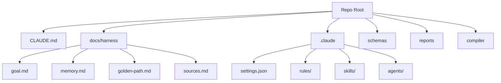
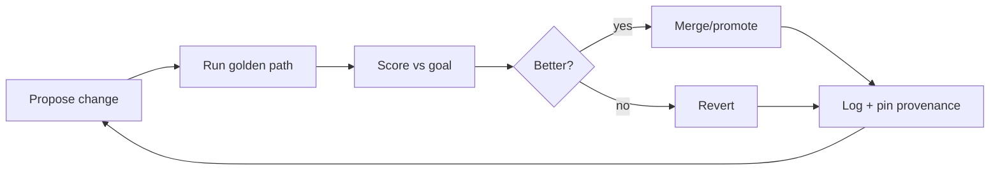

# Diagrams — System, dataflow, and agent lanes

## Purpose

Keep a small set of diagrams that make the harness understandable at a glance.

## Required diagrams

1. **System-as-filesystem** (root folders + contracts)
2. **Agent team lanes** (who owns what)
3. **Outer loop (meta-harness)** (propose → evaluate → keep/revert)
4. **Artifact flow** (inputs → transformations → outputs)

## Diagram formats

- Mermaid (preferred for portability)
- PNG/SVG exports (optional)

## Mermaid: System-as-filesystem (draft)

## Mermaid: Outer loop (draft)

