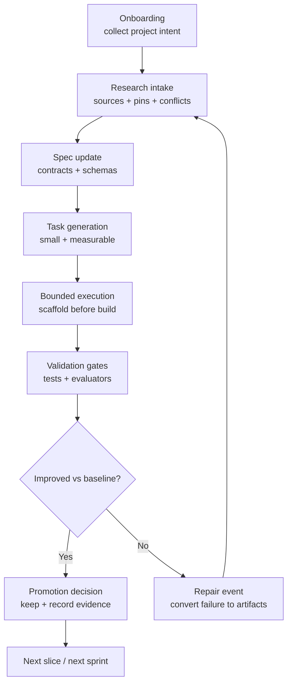

# FRE Harness — Agent Entry Point (Read First)

<aside>
🚪

**Read this first**: This is the canonical entry point for applying **FRE** to any project (project-agnostic). It defines the onboarding questions, the loop, and the required artifacts/gates.

</aside>

## 1) Onboarding (questions you must ask before building)

1. Project name (kebab-case)
2. One-sentence purpose
3. What does “green” mean? (measurable acceptance criteria)
4. First vertical slice (end-to-end)
5. Constraints (time/budget/privacy/tooling)
6. Required outputs (docs/schemas/tests/evals/diagrams)

## 2) The FRE loop (fractal: same at every scale)

- **Research → Spec → Tasks → Build → Test → Evaluate → Promote/Repair**
- Zoomed out: milestone/sprint loops
- Zoomed in: single-task loops

## 3) Mandatory gates (must pass before promotion)

1. Envelope gate (front + bottom matter present)
2. Source gate (claims tied to source records)
3. Spec authority gate (changes trace to spec)
4. Schema/example gate (contracts + examples exist)
5. Test gate (contract/scenario/regression)
6. Doc parity gate (docs/diagrams/golden paths updated)
7. Promotion decision recorded (keep/revert/investigate)

## 4) Canonical artifact set (minimum)

- `docs/research/` (source map, version matrix, open questions)
- `docs/specs/` (governing specs + schemas)
- `docs/golden-paths/` (validated procedures)
- `docs/evals/` (scorecards + sprint reviews)
- `docs/diagrams/` (system + validation flow)
- `tests/` (contracts + scenarios + fixtures)
- `harness/` (manifests + evaluators + promotion + repair)

## 5) Canonical diagram (control flow)

## 6) How to stop

Stop a loop only when:

- metrics plateau (no further improvement), OR
- acceptance criteria satisfied for this phase, AND
- promotion gates pass and evidence is recorded.