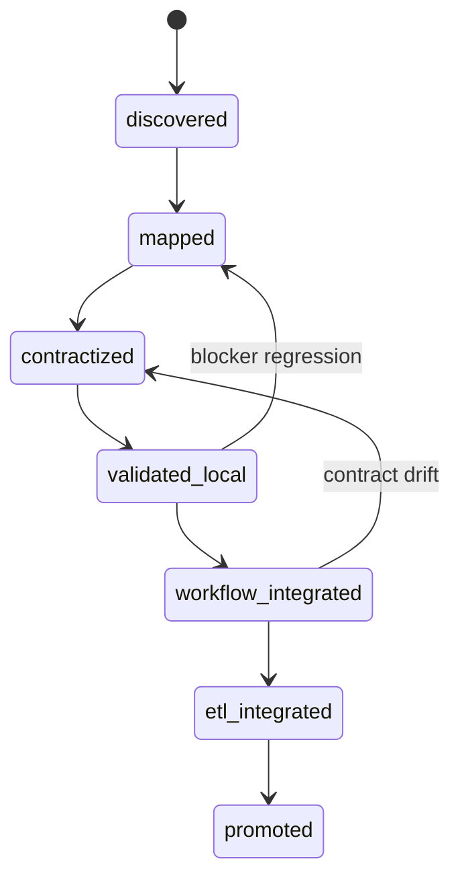

# Capability Promotion Pipeline Specification

## Canonical promotion states
`discovered -> mapped -> contractized -> validated-local -> workflow-integrated -> etl-integrated -> promoted`

## Gate checks per transition
1. schema/contract conformance
2. runtime truth + blocker precision
3. observability coverage
4. reproducibility evidence
5. readiness evidence alignment

## L3: Promotion state machine

## Promotion Stateboard reference
- `docs/specs/artifacts/promotion-stateboard.md`

---bottom-matter---
status_summary:
  completeness: 1.0
  confidence: high
  doc_state: active_spec

gate_progress:
  - gate_id: schema_gate
    status: green
    notes: "Anchored to parent contract truth."
  - gate_id: scope_gate
    status: green
    notes: "Preserves same-host active and cross-device blocked boundaries."
  - gate_id: consumer_gate
    status: green
    notes: "Maintains governance/runtime role separation."
  - gate_id: evidence_gate
    status: green
    notes: "Maps to contract-backed artifacts and evidence paths."
  - gate_id: promotion_gate
    status: amber
    notes: "Requires implementation execution to promote beyond planning."

open_questions: []
pending_validations:
  - "Run parent validator after spec updates to confirm no contract regressions."
promotion_criteria:
  - "Spec suite remains aligned to capability matrix and topology contracts."
blocked_by: []
next_iteration:
  owner: "codex"
  objective: "Execute P0 implementation checklist against this specification suite."
